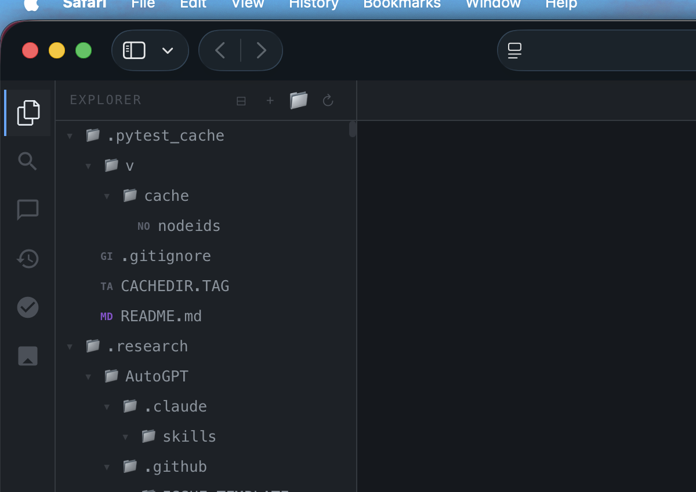

<p align="center">
  
  
  
  
  
</p>

<h1 align="center">Open Seed</h1>

<p align="center">
  <b>Autonomous AGI Coding Engine</b><br>
  <sub>One prompt. Full-stack app. Zero human intervention.</sub>
</p>

<p align="center">
  <code>49 subsystems</code> · <code>40 neural roles</code> · <code>29 tools</code> · <code>Dynamic AGI pipeline</code>
</p>

---

## Screenshots

<p align="center">
  
  <br><sub>VSCode-style Explorer with folder tree, git status badges, drag-and-drop</sub>
</p>

> More screenshots: Run `node app/server.js` and open http://localhost:4040

---

## What is Open Seed?

Open Seed is an **autonomous AI agent** that builds complete software from a single prompt. It does not autocomplete. It does not suggest. It **plans, writes, tests, debugs, and ships** fully autonomously.

```
$ openseed run "Build a full-stack todo app with React and Express"

  [ANALYZE]  intent classification, codebase assessment, risk analysis
  [DESIGN]   architecture, file structure, API design, component breakdown
  [BUILD]    40 specialists write complete code (200 tool call turns)
  [VERIFY]   type-check, lint, tests, build validation
    [FIX]    auto-inserted: fix 3 TypeScript errors
    [VERIFY] re-verify: all clear
  [IMPROVE]  security audit, performance, test coverage
  [REVIEW]   quality gate: PASS

  6/6 steps completed | 14 files created | 0 errors
  workspace/todo-app/   npm install && npm start
```

Powered by **GPT-5.4 + Claude Opus 4.6** via OAuth. **$0 cost** with subscription.

---

## AGI Pipeline V2: Dynamic Steps + Auto-Replan

Unlike fixed pipelines, Open Seed **generates steps dynamically** based on task complexity and **auto-replans on failure**:

```
USER PROMPT
    |
    v
[Complexity Assessment] --> simple | moderate | complex | massive
    |
    v
[Dynamic Plan Generation] --> 4-10+ steps based on complexity
    |
    v
[Step Execution with Inter-Step Memory]
    |
    +-- Each step sees ALL prior results (SharedContext)
    +-- Steps can be inserted/removed at runtime
    +-- Failed verify --> auto-insert fix + re-verify
    +-- Failed fix x2 --> rebuild with different strategy
    +-- Failed review --> fix + re-review
    |
    v
[Complete Project in workspace/{name}/]
```

**Key differences from other agents:**

| Feature | Other Agents | Open Seed |
|---|---|---|
| Step count | Fixed (always same) | Dynamic (4-10+ based on task) |
| Inter-step memory | None (each step independent) | Full (SharedContext carries all results) |
| Failure handling | Stop or skip | Auto-replan (insert fix, rebuild, re-review) |
| Tool call limit | 10-15 per step | 200 per step (build), 100 (fix) |
| Verify iterations | Fixed 3x max | Unlimited (replan inserts more) |
| Strategy on failure | Same approach retry | Different strategy (strategy branching) |

---

## Quick Start

### Web UI (Recommended)

```bash
git clone https://github.com/sueun-dev/open-seed.git
cd open-seed
npm install
npm run build
node app/server.js --port 4040
```

Open **http://localhost:4040** - full IDE with AGI mode, explorer, editor, terminal, AI chat.

### CLI

```bash
# Single agent
node dist/cli.js run "Create a calculator with add, subtract, multiply, divide"

# Team mode (parallel workers)
node dist/cli.js team "Build a REST API with authentication"

# One-prompt app generation
node dist/cli.js create "Build a todo app with React"

# Non-interactive mode (pipe-friendly)
node dist/cli.js prompt "Fix the login bug" -f json -q

# Ask a specific provider
node dist/cli.js ask openai "What's the best way to handle auth tokens?"
node dist/cli.js ask anthropic "Review this error handling pattern"

# Ralph loop (keep going until done)
node dist/cli.js ralph-loop "Refactor the entire auth module"

# Diagnostics
node dist/cli.js doctor
```

### macOS Desktop App

```bash
cd app
pip3 install pywebview pyobjc
python3 desktop.py
```

---

## Provider Setup ($0 with Subscriptions)

### OpenAI (GPT-5.4 via Codex OAuth)
```bash
npx codex auth    # Token auto-detected from ~/.codex/auth.json
```

### Anthropic (Claude Opus 4.6 via OAuth)
```bash
claude auth login  # Token auto-detected from macOS Keychain
```

### API Keys (alternative)
Set via Web UI Settings panel or environment variables:
```bash
export OPENAI_API_KEY=sk-...
export ANTHROPIC_API_KEY=sk-ant-...
```

---

## 29 Built-in Tools

### File Operations
| Tool | Description |
|---|---|
| `read` | Read files with optional hash-anchored line markers |
| `write` | Write complete files (via Diff Sandbox staging) |
| `apply_patch` | Hash-anchored edits (zero stale-line errors) |
| `multi_patch` | Atomic multi-file patches with rollback on failure |
| `ls` | Directory tree listing with depth control |
| `glob` | Pattern-based file discovery |
| `grep` | Regex search across workspace files |

### Shell & Process
| Tool | Description |
|---|---|
| `bash` | Run shell commands (banned command protection) |
| `git` | Git operations |
| `interactive_bash` | Tmux-based interactive terminal (REPLs, debuggers) |
| `process_start` | Start background processes |
| `process_list` | List managed background processes |
| `process_stop` | Stop background processes |

### Code Intelligence
| Tool | Description |
|---|---|
| `lsp_diagnostics` | TypeScript errors and warnings |
| `lsp_symbols` | Symbol extraction and lookup |
| `diagnostics` | LSP diagnostics with severity filter |
| `ast_grep` | AST-based structural code search |
| `repo_map` | Repository structure mapping |

### Network & Search
| Tool | Description |
|---|---|
| `web_search` | Web search for documentation |
| `fetch` | Download URL content (HTML to text conversion) |
| `browser` | Headless browser automation (Playwright) |

### Agent & Memory
| Tool | Description |
|---|---|
| `call_agent` | Spawn specialist sub-agents |
| `look_at` | Multimodal image/screenshot analysis |
| `memory_search` | Search long-term project memory |
| `memory_save` | Save learnings, decisions, conventions |
| `session_list` | List all agent sessions |
| `session_send` | Inter-agent messaging |
| `session_history` | Session event replay |

### Automation
| Tool | Description |
|---|---|
| `cron_create` | Schedule recurring tasks |
| `cron_list` | List scheduled jobs |
| `cron_delete` | Delete scheduled jobs |
| `doctor` | System diagnostics (config, providers, git, disk) |

### Task Management
| Tool | Description |
|---|---|
| `task_create` | Create tracked tasks |
| `task_get` | Get task details |
| `task_list` | List tasks with filters |
| `task_update` | Update task status |
| `background_output` | Read background task results |
| `background_cancel` | Cancel background tasks |

---

## Security

### Banned Commands
The bash tool blocks dangerous patterns automatically:
- `curl | sh`, `wget | sh` (piped remote execution)
- `rm -rf /`, `rm -rf ~` (destructive deletion)
- Fork bombs, `dd` to devices, `mkfs`, `shutdown`, `reboot`
- `nc -l` (netcat listeners), `chmod 777 /`, `eval $(curl ...)`

### Safety Guards
| Guard | What it does |
|---|---|
| Write Guard | Blocks writes to unread files |
| Edit Recovery | Auto-recovers from failed edits |
| Agent Babysitter | Detects and restarts stuck agents |
| Circuit Breaker | Stops cascading failures |
| Stuck Detector | Breaks infinite loops |
| Delegation Retry | Auto-retries failed delegations |
| Context Recovery | Preserves state across compaction |
| Graceful Degradation | Falls back when subsystems fail |
| Diff Sandbox | All writes staged before commit |

---

## 40 Neural Roles

<details>
<summary>View all 40 specialist roles</summary>

**Planning:** orchestrator, planner, issue-triage-agent, api-designer, docs-writer, prompt-engineer, release-manager, cost-optimizer, model-router

**Research:** researcher, repo-mapper, search-specialist, dependency-analyst

**Execution:** executor, git-strategist, pr-author, lsp-analyst, ast-rewriter, build-doctor, test-engineer, debugger, backend-engineer, db-engineer, performance-engineer, devops-engineer, cicd-engineer, observability-engineer, refactor-specialist, code-simplifier, migration-engineer, toolsmith

**Frontend:** frontend-engineer, ux-designer, accessibility-auditor, browser-operator

**Review:** reviewer, security-auditor, risk-analyst, benchmark-analyst, compliance-reviewer

</details>

---

## 49 Integrated Subsystems

| Category | Subsystems |
|---|---|
| **Core Engine** | Event Bus, Enforcer Loop, Task DAG, Spawn Reservation, Hooks, AGI Pipeline V2 |
| **Safety** | Rules Engine, Write Guard, Edit Recovery, File Lock, Agent Babysitter, Circuit Breaker, Banned Commands |
| **Intelligence** | Intent Gate, Codebase Assessment, Model Router, Factcheck, Confidence Engine, Strategy Branching, Debate Mode |
| **Recovery** | Self-Healing, Stuck Detector, Oracle Escalation, Graceful Degradation, Context Recovery |
| **Memory** | Memory Pipeline, Microagents, Context Cache, Project Memory, Prompt Discovery, Memory Tools |
| **Execution** | Diff Sandbox, Verify-Fix Loop, Workspace Checkpoint, Native Tool Calling, Durable Execution |
| **Streaming** | Event Flows, Streaming Protocol, HUD, Token Budget, Cost Tracker, NDJSON stdout |
| **Integration** | MCP Client/Server, Model Variants, Prompt Templates, Repo Map, Language Reviewers |
| **Automation** | Cron Scheduler, Process Manager, Background Agent Manager, Inter-Agent Messaging |

---

## Web UI Features

Full IDE experience in the browser:

- **AGI Mode** - Dynamic pipeline with real-time activity log showing every tool call, phase transition, error, and recovery
- **File Explorer** - VSCode-style collapsible tree, git status badges, drag-and-drop (internal move + external file upload from OS), inline rename, multi-select, file filter (Cmd+P), context menu
- **Code Editor** - Syntax highlighting, line numbers, tab indent, Cmd+S save, dirty indicator
- **Terminal** - Real shell with command history, streaming output
- **AI Chat** - Build / Ask / AGI modes with thinking animation and event cards
- **Settings** - Providers, Safety, Engine, Tools, Expert configuration
- **Dashboard** - Real-time metrics: Phase, Steps, Files, Tools, Tokens, Cost, Elapsed, Replans

### Keyboard Shortcuts

| Shortcut | Action |
|---|---|
| `Cmd+Shift+A` | AI Chat |
| `Cmd+Shift+E` | Explorer |
| `Cmd+S` | Save file |
| `Cmd+J` | Terminal |
| `Cmd+P` | File filter |

---

## AGI Activity Log

Every action is logged in real-time during AGI execution:

```
11:23:01  [read] src/index.ts
11:23:02  [bash] npm init -y --> exit 0
11:23:05  [write] package.json
11:23:06  [write] src/app.ts
11:23:07  [write] src/routes/auth.ts
11:23:08  [bash] npx tsc --noEmit --> exit 1
11:23:09  [diagnostics] 3 errors, 0 warnings
11:23:10  REPLAN #1: Verify found errors -- inserting fix + re-verify
11:23:11  [read] src/routes/auth.ts
11:23:12  [patch] src/routes/auth.ts (2 edits)
11:23:13  [bash] npx tsc --noEmit --> exit 0
11:23:14  Review: PASS
11:23:15  Pipeline COMPLETE: 8/8 steps, 7 files
```

Events shown: tool calls (read/write/bash/grep/glob/patch/git/diagnostics/fetch/ls), phase transitions, session lifecycle, enforcer rounds, review verdicts, delegations, errors, retries, cost updates, sandbox operations, checkpoints, LLM streaming text, stderr output.

---

## CLI Commands

| Command | Description |
|---|---|
| `openseed run <task>` | Run task through orchestration loop |
| `openseed team <task>` | Run with parallel specialist workers |
| `openseed create <prompt>` | One-prompt app generation |
| `openseed prompt <task>` | Non-interactive mode (`-f json`, `-q` quiet) |
| `openseed ask <provider> <question>` | Direct provider query |
| `openseed ralph-loop <task>` | Keep going until 100% complete |
| `openseed start-work <task>` | Planning + execution pipeline |
| `openseed refactor <target>` | Safe refactoring with verification |
| `openseed handoff` | Generate session transfer document |
| `openseed resume <sessionId>` | Resume a previous session |
| `openseed status [sessionId]` | Show session status |
| `openseed doctor` | System diagnostics |
| `openseed init` | Initialize .agent config |
| `openseed init-deep` | Generate AGENTS.md hierarchy |
| `openseed mcp` | Start MCP server (stdio) |
| `openseed check-comments` | Scan for problematic comments |
| `openseed soak` | Provider streaming stress test |

---

## Architecture Highlights

### Research-Backed Design

Built from patterns extracted from **22 open-source repos** (1.4M+ combined GitHub stars):

| Repo | Pattern Adopted |
|---|---|
| **AutoGPT** | Task-Step hierarchy, reactive replanning, error-as-value |
| **MetaGPT** | Message-based inter-agent communication, PLAN_AND_ACT mode |
| **OpenHands** | Event stream, unlimited iterations, stuck detection, memory condenser |
| **SWE-Agent** | Multi-level retry, trajectory checkpointing, context management |
| **Codex** | Long-lived sessions, parallel tool execution, streaming |
| **Aider** | RepoMap context injection, auto-test loop, reflection on failure |
| **Plandex** | Diff sandbox staging, dual mode (plan vs execute) |
| **CrewAI** | Task DAG with dependencies, output chaining between agents |
| **LangGraph** | Typed state graph, checkpoint every step, conditional routing |
| **Cline** | Git-based checkpoints, approval flow, context truncation |
| **OpenCode** | LS/Fetch/Patch tools, LSP integration, permission system, MCP |
| **OpenClaw** | Process management, cron, inter-agent messaging, memory tools |
| **oh-my-claudecode** | Skills system, magic keywords, delegation categories, HUD |
| **oh-my-openagent** | Sisyphus persistence, wisdom accumulation, 46 hooks |

---

## Project Structure

```
open-seed/
  src/
    cli.ts                      # CLI entry point (17 commands)
    core/
      types.ts                  # Type system (40 tool names, providers, roles)
      config.ts                 # Configuration loader
      event-bus.ts              # Central event bus
    providers/
      openai.ts                 # GPT + Codex OAuth (native tool calling)
      anthropic.ts              # Claude (native tool_use)
      registry.ts               # Multi-provider failover
    orchestration/
      engine.ts                 # Core orchestration engine (1300+ lines)
      agi-pipeline.ts           # AGI V2: dynamic steps, inter-step memory, auto-replan
      agentic-runner.ts         # Multi-turn native tool calling loop
      enforcer.ts               # Keep-going-until-done controller
      self-heal.ts              # Automatic error diagnosis and recovery
      debate-mode.ts            # Multi-agent design debate
      strategy-branching.ts     # Multi-attempt with different approaches
      confidence-engine.ts      # Confidence-based decision routing
      human-in-the-loop.ts      # Pause/approve/resume mid-execution
      dependency-graph.ts       # File impact analysis
      stuck-detector.ts         # Infinite loop detection
      circuit-breaker.ts        # Cascading failure prevention
      graceful-degradation.ts   # Fallback when subsystems fail
    tools/
      runtime.ts                # 29 tool implementations (1700+ lines)
      hashline.ts               # Hash-anchored editing
      lsp.ts                    # TypeScript Language Server
      ast-grep.ts               # Structural code search
      browser.ts                # Playwright automation
      diff-sandbox.ts           # Staged write previewing
    safety/
      rules-engine.ts           # Boundary enforcement
      approval.ts               # Tool approval system
    roles/
      registry.ts               # 40 role definitions
    sessions/
      store.ts                  # Session persistence
    memory/
      project-memory.ts         # Cross-session learning
  app/
    server.js                   # Web server with SSE streaming + AGI endpoint
    index.html                  # Full IDE UI (single-file, 1700+ lines)
    desktop.py                  # macOS native app (pywebview)
  tests/
    agi-pipeline.test.ts        # 27 AGI pipeline tests
    tool-runtime.test.ts        # 8 tool runtime tests
    orchestration.test.ts       # 41 orchestration tests
    roles.test.ts               # Role system tests
```

---

## License

MIT

---

<p align="center">
  <b>Open Seed</b><br>
  <sub>Autonomous AGI Coding Engine</sub><br><br>
  <code>One prompt. Complete app. Zero intervention.</code>
</p>
